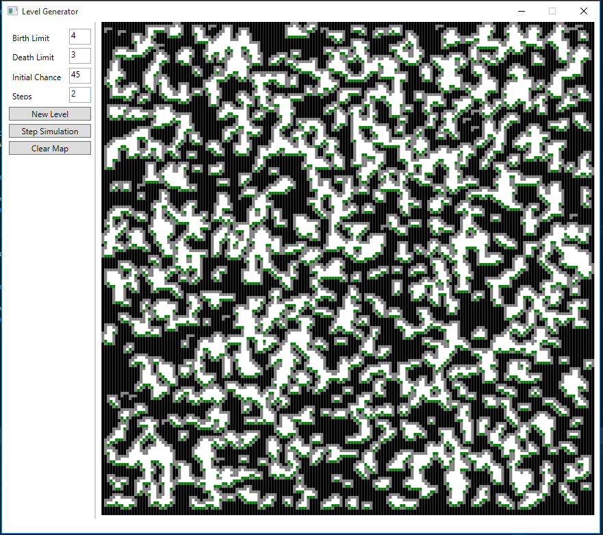

# CellularAutomatonLevelDesign

Procedural level generation in C#. This project is mostly for learning the particulars of the C# language and multi threading (the multi threading portion needs work).
Idea from [Tutsplus](http://gamedevelopment.tutsplus.com/tutorials/generate-random-cave-levels-using-cellular-automata--gamedev-9664).

New Level with default values:

One more simulation step:

Cleared map:

